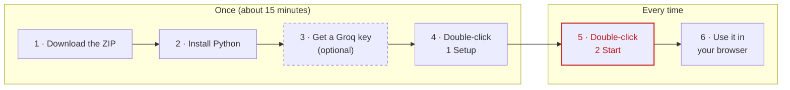

# Getting started: run the demo on your own laptop (Mac, Windows and Linux)

*For everyone in the group. No programming needed: you download a folder, double-click two files, and the
demo opens in your browser. The first time takes about 15 minutes.*

> **Only want to watch or present?** You don't need to install anything:
> - [The online demo](https://victorsaly.github.io/business-analyst-agent-demo/demo/) replays every recorded run.
> - [The presentation](https://victorsaly.github.io/business-analyst-agent-demo/deck/) has 12 slides with speaker notes and a PDF download.
> - [The 60-second pitch](https://victorsaly.github.io/business-analyst-agent-demo/pitch/) is the pitch video.
>
> Install the demo only if you want **Live AI**, where you ask your own questions and the real AI answers.

## What you need

- A Mac, Windows or Linux laptop, with internet.
- About 1 GB of free space.
- 15 minutes.
- Optional: a free Groq key for Live AI (Step 3). Without one, Replay mode still works.

The whole thing at a glance. Steps 1 to 4 happen once; after that, you only do Steps 5 and 6:



## Step 1. Download the project

1. Open <https://github.com/victorsaly/business-analyst-agent-demo>.
2. Click the green **Code** button, then **Download ZIP**.
3. Open your **Downloads** folder and unzip the file:
   - **Mac:** double-click `business-analyst-agent-demo-main.zip`.
   - **Windows:** right-click the zip file, choose **Extract All…**, then **Extract**.
4. Move the unzipped folder somewhere easy to find, for example your Desktop.

You should now have a folder called `business-analyst-agent-demo-main`. Inside it are four files whose names
start with `Mac -`, `Windows -` or `Linux -`:

```text
Mac - 1 Setup.command
Mac - 2 Start.command
Windows - 1 Setup.bat
Windows - 2 Start.bat
Linux - 1 Setup.sh
Linux - 2 Start.sh
```

These are the only files you need to touch. Use the two files for your computer: `Mac`, `Windows` or `Linux`.

## Step 2. Install Python (once)

Python is the free program the demo runs on. You need Python 3.10 or newer. If you are not sure whether you
have it, skip this step: the setup file in Step 4 checks for you and opens the download page if it is missing.

To check by hand:

**Mac**

1. Open **Terminal** (press **⌘ Space**, type `Terminal`, press **Enter**).
2. Type this and press **Enter**:

   ```bash
   python3 --version
   ```

**Windows**

1. Open **PowerShell** (press the **Windows** key, type `PowerShell`, press **Enter**).
2. Type this and press **Enter**:

   ```powershell
   py --version
   ```

You should see a version of 3.10 or higher, for example:

```text
Python 3.12.4
```

**Linux**

Open a terminal and type `python3 --version`.

If you see `command not found`, `not recognized`, or a number below 3.10, install Python:

**Mac**

1. Go to <https://www.python.org/downloads/macos/> and click the latest **Python 3** release.
2. Download the **macOS 64-bit universal2 installer** (`.pkg`).
3. Open it and click **Continue** until it finishes.

**Windows**

1. Go to <https://www.python.org/downloads/windows/> and download the latest **Python 3** "Windows installer (64-bit)".
2. Open it. **On the first screen, tick "Add python.exe to PATH"** at the bottom. This is the step people most often miss.
3. Click **Install Now** and wait until it says *Setup was successful*.

**Linux**

Install it with your package manager. On Ubuntu or Debian, also install `python3-venv`, which Setup needs:

```bash
sudo apt install python3 python3-venv     # Ubuntu, Debian
sudo dnf install python3                  # Fedora
```

## Step 3. Get a free AI key (optional, for Live AI)

1. Go to <https://console.groq.com> and sign up. It's free, and a Google account works.
2. In the menu, click **API Keys**, then **Create API Key**. Give it any name, such as `capstone`.
3. Copy the key (it starts with `gsk_`) and keep it somewhere safe for Step 4. Groq shows it only once.

Don't share your key or put it in a document or chat: anyone who has it can use up your free allowance.

## Step 4. Set up the demo (once)

**Mac**

1. Open the project folder and double-click `Mac - 1 Setup.command`.
2. If macOS says it *can't be opened because it is from an unidentified developer*:
   1. Click **Done**.
   2. Right-click the file, choose **Open**, then click **Open** again.
   3. On newer macOS, if there is no **Open** button: go to **System Settings → Privacy & Security**, scroll down, and click **Open Anyway**.
3. A Terminal window opens and works for a few minutes. Leave it alone until it says `===== SETUP DONE =====`.

**Windows**

1. Open the project folder and double-click `Windows - 1 Setup.bat`.
2. If a blue *Windows protected your PC* box appears, click **More info**, then **Run anyway**.
3. A black window opens and works for a few minutes. Leave it alone until it says `===== SETUP DONE =====`.

**Linux**

1. Open a terminal in the project folder (in most file managers: right-click inside the folder, **Open in Terminal**).
2. Type this and press **Enter**:

   ```bash
   bash "Linux - 1 Setup.sh"
   ```

3. It works for a few minutes. Leave it alone until it says `===== SETUP DONE =====`.

Setup works through four numbered steps, and the window title always shows the current one. Step 3
(installing Python packages) is the slow part: you see package names and progress bars scroll past, which
means it is working. A shortened example (the Mac version; Windows is the same apart from the last lines):

```text
== Business Performance Analyst Agent: setup (Mac) ==

[1/4 Creating the Python environment] in app/.venv ...

[2/4 Updating pip] ...

[3/4 Installing Python packages] This is the slow part, a few minutes. Progress shows below.
Collecting pandas>=2.0
  Downloading pandas-2.2.3-cp312-cp312-macosx_11_0_arm64.whl (11.3 MB)
     ━━━━━━━━━━━━━━━━━━━━━━━━━━━━━━━━━━━━━━━━ 11.3/11.3 MB 8.1 MB/s
...
Successfully installed ...

[4/4 Preparing the AdventureWorks database] ...
Downloading AdventureWorks (about 17 MB)...
  17.2 MB (100%)
  Loading table 1/7: SalesOrderHeader
  ...
Database ready: /Users/you/Desktop/business-analyst-agent-demo-main/app/data/adventureworks.db

===== SETUP DONE =====

Last step: your free AI key for Live AI (get one at https://console.groq.com/keys).
```

If something goes wrong, the window says `===== SETUP FAILED at step …` with the step that failed. Fix the
cause (usually the internet connection) and double-click Setup again; finished steps are quick the second time.

After `SETUP DONE`, a text file called `.env` opens (TextEdit on Mac, Notepad on Windows, your text editor on Linux). To add your key:

1. Click at the end of the line `GROQ_API_KEY=`.
2. Paste your Groq key straight after the `=`, with no spaces. The line should look like this:

   ```text
   GROQ_API_KEY=gsk_your_key_here
   ```

3. Save the file (**⌘ S** on Mac, **Ctrl S** on Windows and Linux).
4. Tell Setup you're done: on **Windows**, close Notepad; on **Mac** and **Linux**, press **Enter** in the Terminal window.
   (On Linux without a desktop, `.env` opens in the terminal editor nano: save with **Ctrl O**, **Enter**, then **Ctrl X**.)
5. Setup checks the key with Groq and shows one of these:

   | Message | Meaning |
   |---|---|
   | `AI key for groq: OK` | All set. Live AI will work. |
   | `NO AI KEY` | `.env` has no key. Fine if you only want Replay; otherwise add it (see above). |
   | `AI KEY REJECTED` | The key is wrong or was deleted in Groq. Copy it again, or create a new one (Step 3). |
   | `could not reach … to check it` | No internet right now. The key may be fine; it is checked again on every Start. |

6. Press **Enter** in the setup window to close it (on Windows, press any key).

No key? Close the `.env` file without changing it. Running Setup a second time is safe: it keeps your `.env`.

## Step 5. Start the demo (every time)

1. Double-click the Start file:
   - **Mac:** `Mac - 2 Start.command`
   - **Windows:** `Windows - 2 Start.bat`
   - **Linux:** in a terminal in the project folder, `bash "Linux - 2 Start.sh"`
2. A window opens. It first checks your AI key (same messages as in Step 4), then shows:

   ```text
   AI key for groq: OK (model openai/gpt-oss-20b).

   Starting the demo... your browser will open http://localhost:8501
   Keep this window open while you present. Close it to stop the demo.
   ```

3. After about three seconds your browser opens <http://localhost:8501>. If the page doesn't load, wait five seconds and refresh it.
4. You see the cover page with the one-minute pitch video. Click **Try the live demo** to open the app.

**Keep the Terminal or black window open** while you use the demo. To stop the demo, close that window.

## Step 6. Use it

- **Live AI / Replay / Dry run** (top right): **Live AI** asks the real AI and needs your key. **Replay** plays
  back a recorded real run and needs no key, and no internet for the AI. Switch to Replay if the wifi or the
  free allowance fails during the presentation.
- **Tracks:** the demo plan. Press a track to play it, or type your own question in the box.
- **View for: Stakeholder / Developer:** a plain-English view of the answer, or every step and query underneath.
- **Explain this page:** a spoken explanation of the screen you're on.

More detail on every screen is in [Running the demo](running-the-app.md).

## Presenting the slides

Open the [presentation](https://victorsaly.github.io/business-analyst-agent-demo/deck/). It runs in the browser, so nothing needs installing.

| Key | What it does |
|---|---|
| **→**, **Space** or a click | Next slide |
| **←** | Previous slide |
| **F** | Full screen (press **Esc** to leave) |
| **N** | Show or hide the speaker notes |
| **P** | Print, or save as PDF |

There is also a ready-made PDF: [presentation.pdf](https://victorsaly.github.io/business-analyst-agent-demo/deck/presentation.pdf).

## If something goes wrong

| What you see | What to do |
|---|---|
| Linux: *"Install Python's venv module"* or *"ensurepip is not available"* | Run `sudo apt install python3-venv`, then run Setup again. |
| Setup seems stuck | Look at the window title: it names the step. Step 3 can take several minutes on slow wifi; as long as lines keep appearing, it is working. |
| *"SETUP FAILED at step …"* | Read the lines just above it. Usually the internet dropped: reconnect and double-click Setup again. |
| *"Python 3.10 or newer is not installed yet"* | Install Python (Step 2), then double-click the Setup file again. On Windows, make sure you ticked **Add python.exe to PATH**. If you didn't, run the Python installer again, choose **Modify**, and tick it. |
| Windows opens the **Microsoft Store** when you run Setup | Install Python from python.org instead (Step 2), then run Setup again. |
| *"Run 'Mac - 1 Setup.command' first."*, *"Run "Windows - 1 Setup.bat" first."* or *"Run 'Linux - 1 Setup.sh' first."* | Do Step 4 before Step 5. |
| The browser says *This site can't be reached* | Wait five seconds and refresh. Check the Start window is still open and shows no error. |
| *"address already in use"* (the Start window closes or shows an error) | The demo is already running in another window. Use that one, or close it and start again. To find it, see [Port 8501 already in use](#port-8501-already-in-use) below. |
| *"NO AI KEY"* or *"AI KEY REJECTED"* when Setup or Start runs, or Live AI says *"No AI key set"* | Open `app/.env` (Step 4) and check the line is exactly `GROQ_API_KEY=gsk_…`. Then close the Start window and start again. On a Mac, `.env` is hidden in Finder: press **⌘ Shift .** to show hidden files. On Linux, press **Ctrl H** in the file manager. |
| Live AI stops with a *rate limit* or *allowance* message | The free Groq plan has a daily limit. If `app/.env` also has an `OPENAI_API_KEY`, the app switches to OpenAI by itself and this doesn't happen. Otherwise switch to **Replay**: it plays back real recorded runs. |
| Setup stopped with an error about the internet | Check your connection (some office or university networks block downloads) and run Setup again. Running it twice is safe. |

Still stuck? Copy the last lines of the Terminal or black window into the group chat, with a screenshot.

### Port 8501 already in use

The demo uses port 8501. If something else already uses it, the Start window shows a line ending in
`address already in use`. To see what is using the port:

**Mac** (in Terminal)

```bash
lsof -i :8501
```

**Windows** (in PowerShell)

```powershell
netstat -ano | findstr :8501
```

If it is an older copy of the demo, close its window. Otherwise you can run the demo on another port; see
[For the technically curious](#for-the-technically-curious).

## For the technically curious

The double-click files run the same commands you can type yourself. All commands run from inside the `app`
folder of the project.

**Mac** (Terminal)

1. Go to the `app` folder (change the path if you put the project somewhere else):

   ```bash
   cd ~/Desktop/business-analyst-agent-demo-main/app
   ```

2. Set up once. `demo.sh setup` also installs the browser used to record the demo video:

   ```bash
   ./demo.sh setup
   ```

3. Start the demo:

   ```bash
   ./demo.sh app
   ```

**Windows** (PowerShell)

1. Go to the `app` folder:

   ```powershell
   cd $HOME\Desktop\business-analyst-agent-demo-main\app
   ```

2. Set up once:

   ```powershell
   py -3 -m venv .venv
   .venv\Scripts\python -m pip install -r requirements.txt
   if (-not (Test-Path .env)) { Copy-Item .env.example .env }
   ```

3. Start the demo, then open <http://localhost:8501> and click **Try the live demo**:

   ```powershell
   .venv\Scripts\python server.py
   ```

To use a different port, set `PORT` before starting the server, then open that port in the browser
(for example <http://localhost:8502>):

**Mac**

```bash
PORT=8502 .venv/bin/python server.py
```

**Windows**

```powershell
$env:PORT = "8502"; .venv\Scripts\python server.py
```
