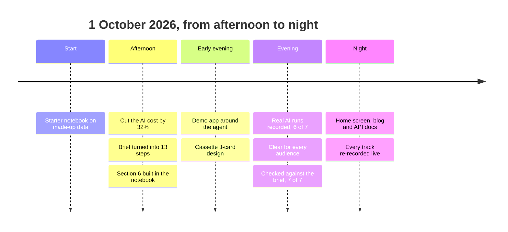

# How we got here: project history

A course project, not a product: Capstone 2 of the Agentic AI Workshop 2026, which asks for a "Business
Performance Analyst Agent" that answers managers' questions about sales data. The company, AdventureWorks,
is Microsoft's public sample database of a made-up bicycle maker. No real business data is used.

Everything happened on 1 October 2026. Times are UK time, taken from file timestamps and the git
history, so they are approximate.



## The starting point (15:15)

The course gave us a starter notebook and a training guide. The notebook already had a working agent
"engine": a loop that lets an AI model pick tools, retry logic for the free Groq AI plan, a scorecard
and a weekly briefing. It ran on made-up data: a pretend retailer with North, South, East and West
regions, prices in pounds, and four planted "stories" to find.

The brief asked us to:

- use Microsoft AdventureWorks sample data instead of made-up data;
- build five tools: `get_schema`, `run_sql`, `run_python`, `make_chart`, `detect_anomalies`;
- enforce four guardrails: read-only access, always show the query, say when the data can't answer,
  never present a forecast as a fact;
- produce a one-page weekly leadership briefing, and demo it all in six minutes.

## Step 1: Cut the AI cost (about 16:00 to 16:50)

The free Groq plan allows about 8,000 tokens a minute and 200,000 a day. We measured where the tokens
went: every round of the agent loop re-sends the rulebook and the whole tool menu. Shortening both cut
the fixed cost per round by 32% (about 2,650 to 1,810 tokens), and one anomaly scan of five metrics
went from five rounds to one. Notes: [prompt-optimization.md](prompt-optimization.md).

## Step 2: Turn the brief into a plan (afternoon)

We wrote the brief out requirement by requirement (18 items, P1 must-have to P3 stretch) and turned it
into 13 steps a non-programmer can follow: where to click, what to paste, why, and how to check it
worked. The main decision: keep the engine and swap what's underneath. Sections 1 to 5 of the notebook
stay as they were, and a new Section 6 goes at the bottom. Guide: [build-guide.md](build-guide.md).

## Step 3: Build Section 6 in the notebook (afternoon, finished 20:49)

In a copy of the notebook, [notebooks/capstone2_business_analyst_adventureworks.ipynb](../notebooks/capstone2_business_analyst_adventureworks.ipynb):

- **6A** downloads AdventureWorks (31,465 orders, May 2022 to June 2025) into a SQLite file that is
  opened read-only, with one simple view, `sales_lines`. Margin = LineTotal - OrderQty x StandardCost.
- **6B** the five tools. `run_sql` refuses anything but a single SELECT. `detect_anomalies` flags months
  or weeks far off their own recent trend (more than 2.5 "normal wobbles" from the average of the
  previous 8 periods).
- **6C** (stretch) `explain_change` splits a change into volume, price and mix.
- **6D** the tool "menu cards" the AI reads; **6E** the new rulebook with the four guardrails.
- **6F** switches the agent over, shows the exact queries from the tool log (never from the AI's own
  words), and lets follow-up questions remember earlier answers.
- **6G** a new scorecard: the brief's four questions plus three guardrail traps, with expected answers
  worked out from the database every time.
- **6H** the weekly briefing: the KPI table comes straight from SQL, so the AI can't mistype it.
- A planted anomaly for rehearsing: a fake 25% bike discount in Northwest, May 2024, in a separate copy of
  the database ([data.py](../app/analyst/data.py)):

```python
AW_PLANT = {"territory": "Northwest", "month": "2024-05", "category": "Bikes", "extra_discount": 0.25}
```

## Step 4: A demo app around the same agent (from 19:48)

A notebook is hard to present. We moved the same code into a small Python package (`app/analyst`)
behind a FastAPI server, with a hand-built web page and three modes: Live AI, Replay (plays
back a recorded live run, step by step, as a backup if the wifi or AI fails) and Dry run (no AI,
for testing the screens only). 27 automatic checks run without any AI key.

## Step 5: Product brief and design (20:08 to 20:33)

We wrote down who it's for (judges and a "leadership team" watching a projector) and what success
looks like ([product.md](product.md)). For the look we chose a hand-lettered cassette J-card instead of
the usual dark AI dashboard: the six-minute demo as a mixtape, with side A for the brief's questions and side B
for the guardrails ([design.md](design.md)).

## Step 6: Real AI runs, recorded (20:36 to 20:58)

The free Groq plan ran out of its daily allowance during testing, so the agent now falls back to
OpenAI automatically (gpt-5.4-mini). We ran every demo question live once and recorded it for
Replay. On those first recordings the scorecard passed 6 of 7. The miss: asked for a return rate, the
AI treated orders with negative quantities as "returns" and stated "0.00%", instead of saying the data has
no returns (fixed in Step 8). We also made a 60-second pitch video with music and a voiceover from ElevenLabs.

## Step 7: Make it clear for every audience (21:00 onwards)

- Fixed a stall on the briefing screen: an earlier run left behind on another screen could hold the
  server's one-run-at-a-time lock. A new run now stops the old one, the KPI table appears at once,
  and a status line ticks every second, so a slow AI never looks frozen.
- Stakeholder and Developer views: stakeholders see only the answers, numbers and charts, with every
  step in plain English. Developers see every tool call, its arguments, the SQL, timings and tokens.
- Explain this page: a spoken explanation of every screen for each audience (ElevenLabs), with
  captions that light up word by word in time with the voice.
- An online copy on GitHub Pages that replays the recorded runs, plus this history and a Story chat.
- A clean public repo: code in `app/`, documentation in `docs/`, the online copy in `site/`.
- A blog, ["How this was made"](index.md), published with the site, and an Ask chat for course
  students that answers from the course's training guide and starting notebook, our notebook and these notes.
  Online, it runs through a small Cloudflare Worker with a daily limit.

## Step 8: Check every line of the brief (evening)

We went through the printed brief line by line and recorded the evidence for each requirement in
[requirements.md](requirements.md). That found three gaps, now fixed:

- **Say when the data can't answer**: the rulebook now also forbids building a stand-in from other columns
  ("negative quantities are not returns"). Re-recorded live, the agent says "The data does not include
  returns". The scorecard on the recordings is now 7 of 7.
- **Cost** is now a metric in the anomaly scan, next to revenue, margin and volume.
- **The demo moment**: the planted anomaly is recorded. The agent found the planted bike discount in
  Northwest, May 2024 (reseller discount up to about 22%, margin down to a loss of $96,403).

## Step 9: A finished product (night)

- **A Home screen** as the app's front door, with every screen, the blog, the API reference, the pitch and the
  presentation.
- **The Ask chat** became a floating button on every screen. Answers stream in as they're written, number their
  sources, and link to the matching blog pages, the API reference and the code. It answers from the course's
  training guide and starting notebook, our notebook and these notes. Online it runs through a small Cloudflare
  Worker that holds the AI key and caps questions per day.
- **The blog** ("How this was made", with before-and-after code) is served by the app at `/blog/` and published
  with the website. **The API reference** documents every endpoint with Redoc, and a **start page** links every
  service.
- **Every demo track was re-recorded live** with the final rulebook, so Replay shows what the finished agent does.

## What we learned

- **Keep the engine, change the inputs.** Adding Section 6 instead of rewriting meant nothing that
  worked before broke.
- **Never trust the model with numbers it can look up.** KPI tables and "show the query" come from
  code and the tool log, not from the AI's words.
- **Measure the tokens.** On a free plan, the fixed text sent each round is the real cost.
- **Have a fallback for live demos.** Labelled replays of real runs kept the demo going when the AI
  allowance ran out.
- **Mark honestly.** The scorecard checks numbers against the database. When one answer failed, we fixed
  the rule, not the marking.
- **Check against the brief itself.** Reading the printed brief line by line found gaps the tests didn't.

## Scope

- **Online, the demo replays recorded live runs.** Asking the agent your own questions runs on your machine,
  because it needs an AI key on a server. The Ask chat is the exception: it answers live online, within a daily limit.
- **The brief's backup dataset** (UCI Online Retail II) is optional, and wasn't needed: AdventureWorks has the
  cost data that margin needs.
