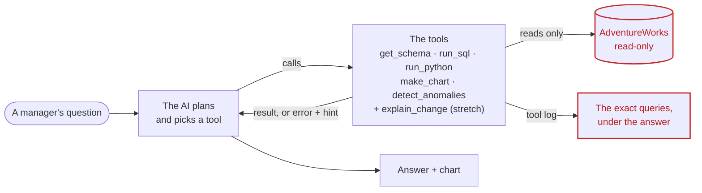
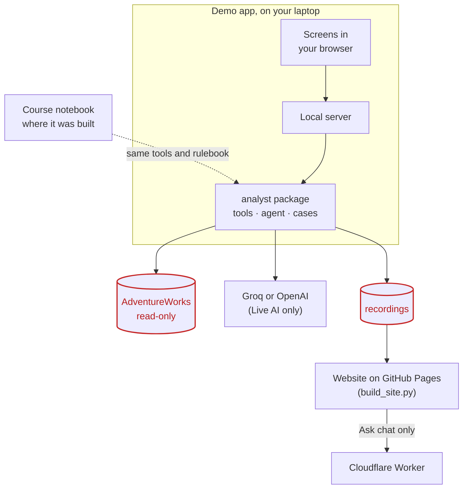

# How this was made: from a course notebook to an analyst agent you can check

*A course demonstration: Capstone 2 of the Agentic AI Workshop 2026, built on 1 October 2026.*

**[Home](https://victorsaly.github.io/business-analyst-agent-demo/)** · **[Open the demo](https://victorsaly.github.io/business-analyst-agent-demo/demo/)** ·
**[The code](https://github.com/victorsaly/business-analyst-agent-demo)** ·
**[Every requirement, with evidence](requirements.md)**

> This is a learning project, not a product. AdventureWorks is Microsoft's public sample database about a
> made-up bicycle company. No real business or personal data is used.

## The question we were given

The brief starts with a problem every analyst knows. Managers ask simple questions, such as *"How did we do
last month?"* or *"Which products are losing margin?"*. Then they wait in a queue, and the answer arrives days
later as a spreadsheet that needs its own explanation.

The mission: build an agent that answers plain-English business questions by writing and running analysis
over the data. It draws a chart, explains what drove the result, flags anything unusual, and at the end of the
week writes a one-page briefing for the leadership team. It must use five named tools, follow four
non-negotiable guardrails, handle four "try these first" questions, and be demoed in six minutes.

## Where we started

The course gave us a notebook with a working agent engine: a loop that lets an AI model choose tools,
retry logic for the free Groq AI plan, a scorecard and a briefing page. Everything ran on made-up
data: a pretend retailer with North, South, East and West regions, prices in pounds, different tools
(`get_data_overview`, `query_metric`, `compare_periods`, …) and four planted "stories" to find.

The first decision was to **keep the engine and swap what's underneath**. We left Sections 1 to 5 of the
notebook untouched and added a new Section 6 at the bottom. Nothing that already worked could break, and team
members who don't write Python could follow along cell by cell
([the step-by-step guide](build-guide.md)).

## How it works, in one picture

The AI never sees the database directly. It asks one of its tools (the brief's five, plus `explain_change`, a stretch goal), each tool reads the data, and the tool
log, not the AI, supplies the queries shown under every answer.



### What lives where

The same agent code runs in three places. The notebook is where it was built; the demo app wraps the same
tools and rulebook; the website is that app with every answer saved in advance.



## The brief, requirement by requirement

Each line of the brief, what the original notebook had, what we built, and where to see it.
The "Steps" link to the [build guide](build-guide.md); the notebook is
[capstone2_business_analyst_adventureworks.ipynb](../notebooks/capstone2_business_analyst_adventureworks.ipynb).

| # | The brief asks | Before (original notebook) | After (what we built) | Where |
|---|---|---|---|---|
| 1 | Use Microsoft AdventureWorks | Made-up retailer, in pounds | The official sample (31,465 orders, May 2022 to June 2025, ten territories) in a SQLite file the agent can only read | [Step 2](build-guide.md#step-2-load-adventureworks-read-only), [data.py](../app/analyst/data.py) |
| 2 | `get_schema()`: tables, columns, data dictionary | `get_data_overview` on the old data | Tables, columns, date range and a plain-English data dictionary, including what is *not* in the data | [Step 3](build-guide.md#step-3-the-five-tools), [tools.py](../app/analyst/tools.py) |
| 3 | `run_sql(query)`: read-only | No SQL at all | One SELECT at a time; anything that changes data is refused; the file is opened read-only | [Step 3](build-guide.md#step-3-the-five-tools) |
| 4 | `run_python(code)`: pandas sandbox | None | pandas and numpy on earlier results; no imports, files or system access; 10-second limit | [Step 3](build-guide.md#step-3-the-five-tools) |
| 5 | `make_chart(data, type)`: bar, line or breakdown | Line and bar on the old data only | Bar, line and breakdown charts drawn from any query result | [Step 3](build-guide.md#step-3-the-five-tools) |
| 6 | `detect_anomalies(metric)`: values off trend | Worked on the old data only | Each month or week compared with its own recent trend, for revenue, margin, cost, volume, orders, margin % and discount %, by territory, category, channel and more | [Step 3](build-guide.md#step-3-the-five-tools) |
| 7 | Margin = LineTotal − (OrderQty × StandardCost) | A different formula | Exactly that formula, in the `sales_lines` view | [Step 2](build-guide.md#step-2-load-adventureworks-read-only) |
| 8 | Guardrail: read-only database | No database | Read-only connection, plus the SELECT-only check as a second layer | [Step 2](build-guide.md#step-2-load-adventureworks-read-only), [Step 3](build-guide.md#step-3-the-five-tools) |
| 9 | Guardrail: always show the query | Showed tool steps, not queries | The exact queries under every answer, taken from the tool log, never from the AI's own words | [Step 7](build-guide.md#step-7-switch-the-agent-over-and-show-its-working) |
| 10 | Guardrail: say when the data can't answer | In the rulebook, for the old topics | New list of what AdventureWorks doesn't have (returns, competitors, satisfaction, …), and no stand-ins built from other columns | [Step 6](build-guide.md#step-6-the-agents-rulebook-system-prompt) |
| 11 | Guardrail: never present a forecast as fact | Not covered | Show the past trend; any projection labelled "ESTIMATE, not a fact" | [Step 6](build-guide.md#step-6-the-agents-rulebook-system-prompt) |
| 12 | Map questions to the right tables and metrics | Old data | A rulebook that says how to compute each metric and compare periods, for the new data | [Step 6](build-guide.md#step-6-the-agents-rulebook-system-prompt) |
| 13 | Fix its own errors | Retry logic existed | Every tool error now comes back with a hint about how to fix it | [Step 3](build-guide.md#step-3-the-five-tools) |
| 14 | Explain what drove a result | Old data | Break a change down by channel, category and discount before giving a reason | [Step 6](build-guide.md#step-6-the-agents-rulebook-system-prompt) |
| 15 | The four "try these first" questions | Old questions only | All four answered and marked by a new scorecard | [Step 8](build-guide.md#step-8-the-new-scorecard), [Step 10](build-guide.md#step-10-try-it-the-briefs-questions) |
| 16 | One-page weekly leadership briefing | Old data | The KPI table straight from SQL, so the AI can't mistype it; the AI writes the commentary | [Step 9](build-guide.md#step-9-the-weekly-leadership-briefing) |
| 17 | Demo moment: explain a planted anomaly | Old planted stories | A separate copy of the database with a planted 25% bike discount in Northwest, May 2024 | [Step 12](build-guide.md#step-12-rehearse-the-planted-anomaly) |
| 18 | Stretch: follow-up drill-downs | None | "…and by product category?" remembers the last answers | [Step 7](build-guide.md#step-7-switch-the-agent-over-and-show-its-working) |
| 19 | Stretch: volume, price and mix | A margin bridge on the old data | `explain_change`: three parts that always add up to the total change | [Step 4](build-guide.md#step-4-stretch-volume--price--mix-breakdown) |
| 20 | Backup dataset (UCI Online Retail II) | None | Optional; not needed, because AdventureWorks has the cost data margin needs | [requirements](requirements.md) |

## Before and after, in code

The five biggest changes, with the code. **Before** is the course's starting notebook (Sections 1 to 5,
kept unchanged in [our notebook](../notebooks/capstone2_business_analyst_adventureworks.ipynb)); **after** is our
Section 6 and the [demo app](../app/analyst).

### 1. The data: made-up numbers → AdventureWorks, read-only

**Before**: the notebook generated a pretend retailer, so margin was whatever the generator produced:

```python
# Section 1: building the pretend data
gross_margin = np.round(revenue - cogs - freight_cost, 2)
```

**After**: real sample data, with the brief's own formula, in one view the agent can only read
([data.py](../app/analyst/data.py)):

```sql
CREATE VIEW sales_lines AS
SELECT ...
       d.LineTotal                                      AS revenue,
       d.OrderQty * p.StandardCost                      AS cost,
       d.LineTotal - d.OrderQty * p.StandardCost        AS margin   -- Margin = LineTotal − (OrderQty × StandardCost)
```

```python
# opened read-only: even a bug can't change the file
sqlite3.connect(f"file:{db}?mode=ro", uri=True)
```

### 2. The tools: fixed functions → read-only SQL

**Before**: the AI could only call fixed helpers on the pretend data:

```python
def query_metric(metric, group_by=None, filters=None, period="all"):
    """Add up one metric, optionally split by up to 2 dimensions, filtered and for a period."""
```

**After**: the brief's `run_sql`. The AI writes its own query, and the tool only runs it if it reads
([tools.py](../app/analyst/tools.py)):

```python
def run_sql(query, max_rows=AW_MAX_ROWS):
    """Run ONE read-only SELECT query. Returns the query itself, the rows, and a result id."""
    if not re.match(r"^(select|with)\b", sql, re.I):
        return {"error": "Only SELECT (or WITH ... SELECT) queries are allowed. The database is read-only.", "query": sql}
    if ";" in sql:
        return {"error": "Send one query at a time (no ';').", "query": sql}
    if _AW_BLOCKED_SQL.search(sql):
        return {"error": "That query contains a word that changes data. Only reading is allowed.", "query": sql}
```

### 3. The rulebook: no forecast rule → four non-negotiable guardrails

**Before**: sound rules, but nothing about forecasts or about writing to the data:

```text
RULES
1. Every number you state must come from a tool result in this conversation. ...
7. If the question is about something this data does not contain (e.g. competitors or their
   prices, ...), do NOT answer with other metrics. Say plainly: "The data does not include <topic>"
```

**After**: the brief's four guardrails, first in the rulebook ([agent.py](../app/analyst/agent.py)):

```text
GUARDRAILS (non-negotiable)
1. Every number you state must come from a tool result in this conversation. ...
2. The database is read-only. Only ever write SELECT queries.
3. If the data cannot answer the question ..., say plainly "The data does not include <topic>" ...
4. Never present a forecast or a guess as a fact. ... if you add any projection, label it
   "ESTIMATE, not a fact" and state the assumption.
```

### 4. Show the working: tool steps → the exact queries, from the tool log

**Before**: answers listed which tools ran, not the queries behind the numbers.

**After**: every answer ends with the exact SQL or code the tools ran, read from the tool log
([agent.py](../app/analyst/agent.py), `queries_used`):

```python
def queries_used(trace):
    """'Always show the query': taken from the tool log, never from the AI's own words."""
    for t in trace or []:
        if t["tool"] == "run_sql":
            out.append({"label": f"run_sql {r.get('result_id', '')}{failed}", "lang": "sql", "text": a.get("query", "")})
```

### 5. A rule tightened after checking the brief

Asked for a return rate, the AI once treated orders with negative quantities as "returns" and reported 0.00%.

**Before**:

```text
   say plainly "The data does not include <topic>" and say what data would be needed. Do not
   answer with a different metric instead.
```

**After**: one more sentence, and the answer became *"The data does not include returns"*:

```diff
   say plainly "The data does not include <topic>" and say what data would be needed. Do not
-  answer with a different metric instead.
+  answer with a different metric instead, and never build a stand-in from other columns
+  (for example, negative quantities are not returns).
```

## Making it cheaper to run

On the free Groq plan (about 8,000 tokens a minute, 200,000 a day) the agent kept waiting on rate limits. We
measured why: every round of the agent loop re-sends the rulebook and the whole tool menu. Shorter versions cut
the fixed cost per round by 32% (about 2,650 to 1,810 tokens), and one anomaly scan of five metrics went from
five rounds to one.
([prompt-optimization](prompt-optimization.md))

## The playground: every improvement to the demo app

A notebook is hard to present to a room, so we built a small app around the same agent code. The changes,
in order:

**1. From notebook to app**

- The Section 6 code moved into a Python package, [`app/analyst`](../app/analyst), behind a small FastAPI
  server that streams each tool call to the page as it happens.
- Three labelled modes: Live AI; Replay of a recorded live run, as a backup if the AI or wifi
  fails; and Dry run (no AI, for testing the screens only).
- Every live run is recorded automatically, so Replay always shows a real AI run.
- 36 automatic checks that need no AI key: guardrails, every demo case, the briefing, the examiner, the
  competitor price list, and the live loop against a fake AI server ([test_demo.py](../app/test_demo.py)). For example:

```python
check("DELETE refused", "error" in T.run_sql("DELETE FROM SalesOrderHeader"))
check("two statements refused", "error" in T.run_sql("SELECT 1; DROP TABLE Product"))
check("sandbox blocks imports", "error" in T.run_python("import os"))
```

**2. Designed for a room**

- A clear audience and goal, written down first ([product](product.md)).
- The look of a hand-lettered cassette J-card: the six-minute demo as a mixtape. Side A holds the brief's
  questions and side B the guardrails, briefing and scorecard, plus a hidden rehearsal track
  ([design](design.md)).
- Every track has a time budget, and both sides add up to exactly 6:00. A tape counter and a red bar show time
  used, and turn red on overrun.
- Presenter tools: press **Z** to zoom into anything, and adding `?presenter=1` to the page address shows a
  talking-point note on each screen.

**3. Reliable when it matters**

- When Groq's daily allowance runs out, the agent switches to OpenAI (gpt-5.4-mini by default) and keeps
  going. The footer shows which model answered.
- It waits out short rate limits, adapts to each provider's settings, and trims old tool results to stay
  within the free plan's request size.

**4. Videos**

- A narrated walkthrough recorded from the replays, and a 60-second pitch video with music and a
  voiceover from ElevenLabs ([audio sources](audio-sources.md)).

**5. Clear for every audience**

- Fixed a stall: a run left behind on another screen could block the next one with no sign. Now a new run
  stops the old one, the briefing's KPI table appears at once, and a status line ticks every second. If a live
  run goes over its time slot, a button offers the recorded run instead.
- Stakeholder / Developer views: stakeholders see the answers, numbers and charts, with each step in
  plain English. Developers see every tool call, its arguments, the SQL, timings, AI rounds and tokens.
- Explain this page: a spoken explanation of every screen for each audience (ElevenLabs). Captions light
  up word by word, timed from pauses measured in each clip.

**6. Open to the public**

- An online copy on GitHub Pages that replays every recorded run. The live AI stays local, because it
  needs a paid API key that visitors could use up.
- A Story screen with the project timeline, and an Ask chat for course students. It answers questions
  about the task, each step and how we built it, and cites its sources: our notes, the course's training guide
  and starting notebook, and our notebook. Online it runs through a small
  Cloudflare Worker that holds the AI key and caps questions per day ([how it works](running-the-app.md#the-ask-chat-local-and-online)).
- A logo, clear "course demonstration" labels, and a tidy repo: code in `app/`, documents in `docs/`, the
  online copy in `site/`.

**7. Checked against the brief itself**

- We went through the printed brief line by line ([requirements](requirements.md)) and found three gaps the
  tests hadn't:
  - Asked for a return rate, the AI had treated negative quantities as "returns". The rulebook now forbids
    stand-ins, and the re-recorded answer says "The data does not include returns".
  - Cost became a metric in the anomaly scan.
  - The planted-anomaly demo moment was recorded. The agent found the planted discount and the $96,403 loss.

**8. A finished product**
- A **Home** screen as the app's front door: every screen, the blog, the API reference, the pitch and the
  presentation in one place.
- The **Ask chat** became a floating button on every screen. Its panel keeps the conversation while you move
  around, streams each answer as it's written, numbers its sources, and ends with links to the blog pages, the API
  reference and the code that go with the answer. It answers from the course's training guide and starting
  notebook, our notebook and these notes, locally through the app and online through a small Cloudflare Worker
  with a daily limit.
- The **blog** (this page) is served by the app at `/blog/` and published with the website, with this
  before-and-after code; the **API reference** documents every endpoint with Redoc; a **start page** links every
  service.
- Every demo track was **re-recorded live** with the final rulebook, so Replay shows what the finished agent does.

## Where it ended up

- Every requirement in the brief is met, with evidence for each in [requirements](requirements.md).
- Scorecard 7 of 7 on the recorded runs: the four "try these first" questions and three guardrail traps,
  marked against answers worked out from the database. It was 6 of 7 until we fixed the returns answer.

## What we learned

- **Keep the engine, change the inputs.** Adding Section 6 instead of rewriting meant nothing that worked broke.
- **Never trust a model with numbers it can look up.** KPI tables and the "show the query" lists come from code
  and the tool log, not from the AI's words.
- **Measure the tokens.** On a free plan, the fixed text sent every round is the real cost.
- **Plan for a live demo to fail.** Labelled replays of real runs kept the demo going when the AI allowance ran out.
- **Check against the brief, not just the tests.** Reading it line by line found gaps the tests didn't.

## Read more

| Document | What's in it |
|---|---|
| [history](history.md) | The timeline, step by step, with times |
| [requirements](requirements.md) | Every line of the brief, and the evidence it's met |
| [build-guide](build-guide.md) | The brief as 13 steps for non-programmers: every notebook cell we added, and why |
| [running-the-app](running-the-app.md) | Run the demo yourself: setup, modes, screens, presenting, recording |
| [prompt-optimization](prompt-optimization.md) | How we measured and cut the AI's token cost |
| [product](product.md) · [design](design.md) | Who it's for, and how it looks |
| [audio-sources](audio-sources.md) | Where every audio file came from |
