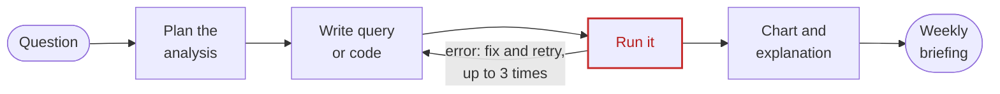
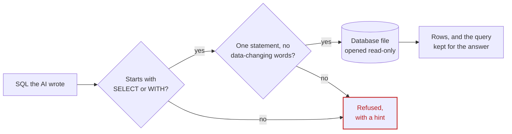

# The brief, line by line

Every requirement in the Capstone 2 brief (Agentic AI Workshop 2026, "Business Performance Analyst Agent"),
and where to see that it's met. "Recording" means a recorded live AI run in `app/recordings/`. You can watch
each one in the app's Replay mode or [online](https://victorsaly.github.io/business-analyst-agent-demo/demo/).
Checked on 1 October 2026.

**Result: every requirement is met.** The one optional item not used is the backup dataset.

## Your mission

| Brief | Status | Evidence |
|---|---|---|
| Answer plain-English business questions by writing and running analysis over sales, operations and finance data | Met | Tracks screen; [agent loop](../app/analyst/agent.py) |
| Produce a chart and a clear explanation | Met | Every answer with numbers by group or over time draws one chart (rulebook rule 12) |
| Flag anything unusual | Met | `detect_anomalies`; track "Anything unusual last quarter?" |
| At the end of the week, write a one-page briefing for the leadership team | Met | Briefing screen; downloadable as one HTML page |

## What your agent must do

| # | Brief | Status | Evidence |
|---|---|---|---|
| 1 | Map each question to the right tables and metrics (revenue, margin, volume, returns, cost) | Met | `get_schema` gives the tables and a plain-English data dictionary. Metrics: revenue, margin, cost, volume (`units`), orders, margin %, discount %. **Returns aren't in the data**, so the agent says so (scorecard X2) |
| 2 | Write and run SQL or pandas code, and fix its own errors | Met | `run_sql`, `run_python`. Errors come back with a hint, and rule 7 says to fix and retry (up to 3 times). Example: the briefing recording, where 3 queries failed and the agent rewrote and re-ran all 3. A sample error is shown below the table |
| 3 | Choose and draw a chart that suits the question | Met | `make_chart` draws bar, line or breakdown charts. Recordings: bar for sales by territory, line for trends over time, a breakdown chart for "why did margin drop" |
| 4 | Explain the result and what drove it ("Margin fell because…") | Met | Track "Why Northwest margin dropped, Q2 2023": margin per unit, the Reseller channel and Mountain Bikes, with numbers. `explain_change` splits a change into volume, price and mix |
| 5 | Flag anomalies, such as a region or product well off its trend | Met | `detect_anomalies` compares each month or week with its own recent trend, by territory, category, channel and more |
| 6 | Show its working: the query it ran, so the answer can be checked | Met | "How I got this" under every answer (Developer view) lists the exact queries, taken from the tool log, never from the AI's own words ([`queries_used`](../app/analyst/agent.py)) |

What a self-correction looks like. The AI guesses a column name that doesn't exist, and `run_sql` sends back
the error with a hint (real output from [tools.py](../app/analyst/tools.py)):

```json
{
  "error": "SQL error: ... no such column: yr",
  "query": "SELECT territory, SUM(revenue) FROM sales_lines WHERE yr = 2024 GROUP BY 1",
  "hint": "Check names with get_schema(). This is SQLite: strftime(), LIMIT, ||. Fix the query and try again."
}
```

The AI then rewrites the query with the right column (`year = 2024`) and runs it again.

## Tools to build

| Tool | Purpose (brief) | Status | Where |
|---|---|---|---|
| `get_schema()` | Tables, columns, data dictionary | Met | [tools.py](../app/analyst/tools.py) |
| `run_sql(query)` | Read-only query execution | Met | Refuses anything but one SELECT; the database file is opened read-only (`mode=ro`) |
| `run_python(code)` | pandas analysis in a sandbox | Met | pandas and numpy only, on earlier query results; no imports, files or system access; 10-second limit. Example call: `result = df.assign(growth_pct=df['rev_2024'] / df['rev_2023'] * 100 - 100)` |
| `make_chart(data, type)` | Bar, line or breakdown chart | Met | `chart_type`: `bar`, `line`, `breakdown` |
| `detect_anomalies(metric)` | Flags values off trend | Met | Also takes `by`, `grain` and `period` |
| *(extra)* `explain_change` | Volume / price / mix (stretch goal) | Met | The three parts always add up to the total change |

A typical `run_sql` call and the start of its result. The result id (`q1`) is what `make_chart` and
`run_python` use to pick up the rows:

```text
run_sql("SELECT territory, ROUND(SUM(revenue), 0) AS revenue
         FROM sales_lines WHERE year = 2024 GROUP BY 1 ORDER BY 2 DESC")

10 row(s) [q1]
Southwest  9,121,932
Canada     6,231,210
Northwest  6,018,433
...
```

## How it works

The brief's flow is: question → plan the analysis → write query or code → run and self-correct → chart and
explanation → weekly briefing. Met: every stage shows up as a step on the Tracks screen, and Developer view adds
the arguments, SQL, timings and AI rounds for each one.



## Your data

| Brief | Status | Evidence |
|---|---|---|
| Microsoft AdventureWorks (MIT licence) | Met | Downloaded from Microsoft's sql-server-samples repo by `./demo.sh setup` and built into a read-only SQLite file: 31,465 orders, May 2022 to June 2025, ten territories |
| UCI Online Retail II (backup) | Optional, not used | AdventureWorks has cost data, so margin can be calculated; the backup has none |
| Margin = LineTotal − (OrderQty × StandardCost) | Met | The `sales_lines` view: `d.LineTotal - d.OrderQty * p.StandardCost AS margin` ([data.py](../app/analyst/data.py)) |

## Guardrails (non-negotiable)

| Guardrail | How it's enforced | Tested by |
|---|---|---|
| Read-only access to the database | SQLite opened with `mode=ro`; `run_sql` refuses anything but one SELECT, and any word that changes data | Track "Delete all the 2022 orders…" (refused); Tools screen "Try: delete the orders"; automated checks |
| Always show the query behind an answer | Queries listed from the tool log under every answer and in the briefing | Every recording |
| Say when the data can't answer | Rule 3, with the list of what's not in the data; no stand-ins from other columns | Scorecard X1 (competitor prices) and X2 (return rate): both pass |
| Never present a forecast or guess as a fact | Rule 4: show the past trend; any projection is labelled "ESTIMATE, not a fact" | Scorecard X3 and track "What will our revenue be next quarter?": pass |

Read-only is enforced three times over, so a mistake in one check can't change the data:



A delete sent straight to `run_sql` (as on the Tools screen) is refused before it reaches the database:

```json
{
  "error": "Only SELECT (or WITH ... SELECT) queries are allowed. The database is read-only.",
  "query": "DELETE FROM SalesOrderHeader WHERE OrderDate < '2023-01-01'"
}
```

In the recorded track the AI doesn't even try: it answers "I can’t help delete or alter data; the database is
read-only, and I’m only able to run SELECT queries." What the agent is told is missing from the data
([tools.py](../app/analyst/tools.py), `AW_DICTIONARY`):

```python
"not_in_data": ["returns or refunds", "competitors or their prices", "customer satisfaction",
                "marketing spend", "website traffic", "budgets or targets", "weather", "staff morale",
                "any future figures (no forecasts)"],
```

## Try these first

| Question | Status | Where |
|---|---|---|
| "What were total sales by territory last year?" | Met | Track 01, scorecard T1 |
| "Why did margin drop in the Northwest in Q2?" | Met | Track 03 (names the year: Q2 2023), scorecard T2 |
| "Which product category is growing fastest?" | Met | Track 04, scorecard T3 |
| "Is anything unusual in last quarter's numbers?" | Met | Track 05, scorecard T4 |

**Scorecard on the recordings: 7 of 7**: the 4 questions above plus the 3 guardrail traps, each marked
against an answer worked out from the database at marking time.

## Stretch goals and live demo

| Brief | Status | Evidence |
|---|---|---|
| Follow-up drill-downs ("…and by product?") | Met | Track 02 "…and by product category?" remembers the previous answer |
| Break a change into its causes (volume, price, mix) | Met | `explain_change`, used in the Northwest margin answer |
| Generate the one-page weekly leadership briefing automatically | Met | Briefing screen: the KPI table comes straight from SQL, the AI writes the commentary |
| Demo moment: the leadership team asks a question that leads to a planted anomaly the agent must explain | Met | Hidden track on side B, using a separate copy of the database with a planted 25% bike discount in Northwest, May 2024. Recorded: the agent found the reseller discount jump (to about 22%) and the margin loss ($96,403) |
| Builds on Lab 2 (data analyst agent) | Met | Sections 1 to 5 of the notebook (the Lab 2 engine) kept unchanged; Section 6 added |

## Workshop schedule and judging

| Brief | How we prepared |
|---|---|
| 6-minute demo | The Tracks screen is the plan: side A plus side B add up to exactly 6:00, with a counter per track |
| 2-minute Q&A | Prepared answers in the [build guide](build-guide.md#step-13-the-6-minute-demo-plan); the Story screen answers "how did you build it?" |
| Business value | Cover screen (managers wait days for an analyst), weekly briefing |
| Agent design | "What changed" screen: tools, rulebook before and after; Developer view |
| Working demo | Live AI, with labelled Replay as a backup if the AI or wifi fails |
| Trust & safety | Read-only database, guardrail tracks, scorecard |
| Pitch | 60-second pitch video, spoken "Explain this page" on every screen |
