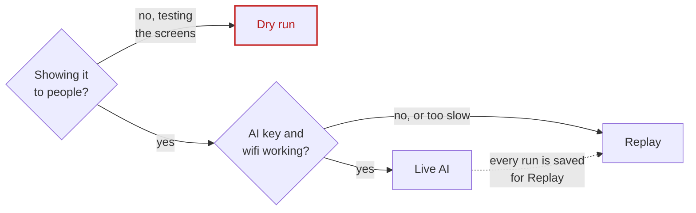
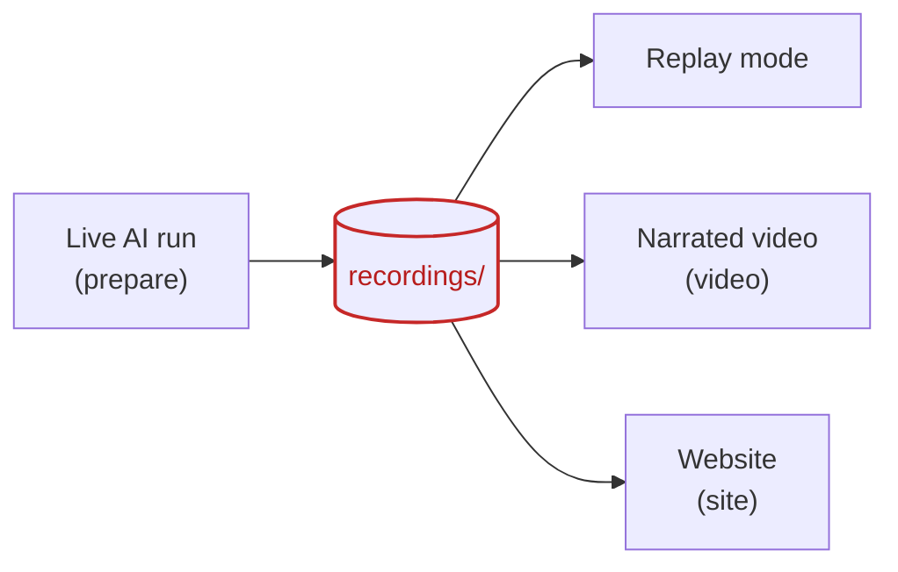
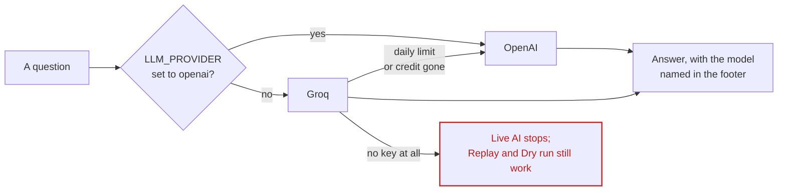
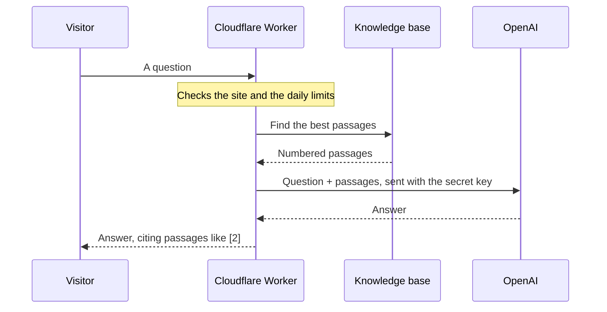

# The demo app: Business Performance Analyst Agent

> Course demonstration (Capstone 2, Agentic AI Workshop 2026). See the [main readme](../readme.md) for the
> project overview and [history.md](history.md) for how we got here. Commands below run from the `app/` folder.
> If you have never used a terminal, follow [Getting started](getting-started.md) instead: it uses double-click files.

A local app that runs the AdventureWorks agent from [build-guide.md](build-guide.md) on your own machine.
It has a screen per demo case, saves every live AI run so you can replay it later, and can record a
narrated demo video.

## Quick start (macOS)

1. Open **Terminal** and go to the `app` folder of the project (change the path to where your copy is):

   ```bash
   cd ~/Desktop/business-analyst-agent-demo-main/app
   ```

2. Set up once. This creates a local Python environment, installs the browser used for the video, and
   downloads the database (17 MB):

   ```bash
   ./demo.sh setup
   ```

   You should see, at the end:

   ```text
   Database ready: /…/app/data/adventureworks.db
   Setup done. Put your key in app/.env, then: ./demo.sh app
   ```

3. Open `app/.env` in a text editor and add your key(s), one per line:

   ```bash
   open -e .env
   ```

   ```text
   GROQ_API_KEY=gsk_...
   OPENAI_API_KEY=sk-...
   ```

   Either key is enough. With no key, Replay and Dry run still work.

4. Start the app. It opens <http://localhost:8501> in your browser: the cover page with the pitch video.
   Click **Try the live demo** to open the app (or go straight to <http://localhost:8501/demo/>):

   ```bash
   ./demo.sh app
   ```

   ```text
   Open http://localhost:8501
   ```

   Leave Terminal open while you use the app. Press **Ctrl C** in Terminal to stop it.

**Windows (PowerShell).** `demo.sh` is a Mac and Linux script. On Windows, use the double-click files in
[Getting started](getting-started.md), or run these from the `app` folder:

```powershell
py -3 -m venv .venv
.venv\Scripts\python -m pip install -r requirements.txt
if (-not (Test-Path .env)) { Copy-Item .env.example .env }
notepad .env
.venv\Scripts\python server.py
```

Then open <http://localhost:8501> and click **Try the live demo**. The video commands below (`prepare`, `video`, `pitch`) also need
`.venv\Scripts\python -m playwright install chromium` and are only tested on a Mac.

## The three modes (top right)

| Mode | Uses the AI? | When to use it |
|---|---|---|
| **Live AI** | Yes | The real thing. Every run is saved to `recordings/` automatically. |
| **Replay** | No (plays back a real AI run, step by step) | Backup for the live demo if the wifi or the free plan fails. Labelled "Replay". |
| **Dry run** | No | Only to test the screens and the video. The steps and numbers are real tool results, but the plan and wording are scripted. Labelled in red. |



One real AI run feeds everything else, so you only pay for it once:



## The screens

The app looks like a hand-lettered cassette J-card, and the demo is laid out as a six-minute mixtape.

| Screen | What it shows | Judging point |
|---|---|---|
| Home | The first screen: every area of the app, the blog, the API reference, the pitch and the presentation, with suggested questions for the chat | Pitch |
| Cover | The problem, how it works, the house rules (guardrails) | Pitch, business value |
| What changed | Before / after, every brief requirement, old vs new rulebook, the tool descriptions | Agent design |
| Tracks | The demo as a tracklist. Side A has the brief's questions, side B the guardrails, briefing and scorecard, plus a hidden rehearsal track. Each track shows its time budget; both sides add up to 6:00. Your own questions go in the box below. | Working demo, trust |
| Tools | Anomaly scan and read-only SQL by hand. "Try: delete the orders" is refused | Trust & safety |
| Briefing | The one-page leadership briefing, downloadable as a standalone HTML page | Business value |
| Scorecard | The brief's 4 questions plus 3 guardrail traps, marked Pass / Fail | Evaluation |
| Story | The project timeline, step by step, with suggested questions for the chat | Pitch |

**The Ask chat** is the button at the bottom right of every screen. It opens a panel that keeps the conversation
while you move between screens. Answers stream in as they're written, number their sources, and end with
**Resources**: the blog pages, the API reference, the presentation or the code that go with the answer. More on
how it works under [The Ask chat](#the-ask-chat-local-and-online).

**The blog** is served by the app too, at `http://localhost:8501/blog/`: every document in `docs/`, in the app's
style, rendered fresh on each visit. The API reference is at `http://localhost:8501/redoc`.

**View for: Stakeholder / Developer** (under the header) switches between two views. Stakeholder shows only
the answers, numbers and charts. Developer adds everything underneath: each tool call, its arguments, the
SQL, timings, AI rounds and tokens.

**Explain this page** plays a spoken explanation for the chosen audience, with word-by-word captions. The
clips and their text are in `web/explain/`. To change a line:

1. Edit the text in `web/explain/scripts.json`.
2. Regenerate that screen's mp3 in the same folder (see [audio-sources.md](audio-sources.md)).
3. Re-measure the caption timings:

   ```bash
   ./demo.sh timings
   ```

Other behaviour worth knowing when presenting:

- Starting a run stops any run still going on another screen, so a forgotten run never blocks the next one.
- On the Briefing screen the KPI table appears at once, and a status line updates every second while the AI works.
- If a live run goes past its time slot, a button offers the recorded run instead.
- While a track plays, the counter top right shows time used against the track's budget. The red bar under
  the header fills as you go, and the counter turns red if you run over.

## Competitor prices (optional, for demos)

AdventureWorks has no competitor data, so by default the agent says so (side B, track 1). To demo a
price comparison, go to **Tools → Competitor prices** and choose one of these:

- **Use the mock price list**: three fictional shops (Summit Cycles, Velo Direct, TrailCraft) with prices
  generated from our list prices. Velo Direct undercuts our Road Bikes by about 20%, which is the finding the
  agent should surface. Answers say the prices are mock.
- **Download the template (CSV)**: the mock list as a file. Edit it, or fill in your own, then upload it with
  **Attach your CSV…**.
- **Detach**: go back to the default (no competitor data).

The CSV needs these columns (prices in $, `observed_date` optional). The first lines of the template:

```text
product,competitor,competitor_price,observed_date
AWC Logo Cap,Summit Cycles,9.55,2025-06-29
AWC Logo Cap,TrailCraft,9.66,2025-06-29
All-Purpose Bike Stand,Velo Direct,157.12,2025-06-29
```

Product names must match AdventureWorks names (case and spacing don't matter). Rows that don't match are
listed back to you.

The list is kept in its own SQLite file in `data/` and attached read-only. The agent sees it as the
`competitor_prices` table and the `price_comparison` view (our list price and online price next to each
competitor's, plus the % gap). Your own questions use the list you picked. The guardrail track and the
scorecard always run without one, so the guardrail still scores. The hidden track "Competitor prices (mock
list attached)" always uses the mock list.

## The 60-second pitch video

`video/pitch.mp4` is a launch-style trailer. In order:

1. A hand-lettered hook and problem card.
2. The app, revealed on the music's drop.
3. Real AI runs, replayed, with zooms into the chart, the answer and the SQL.
4. A three-shot trust montage.
5. An end card on the final hit.

It runs on a 120 BPM music bed with a professional voiceover; the music dips under the voice. The audio was
made with ElevenLabs; see [audio-sources.md](audio-sources.md).

To re-render it from the current recordings (about 1 minute):

```bash
./demo.sh pitch
```

Live runs overwrite their track's recording. So before rendering, `scripts/make_promo.py` checks that each recording
still supports what the voiceover says (for example, that the anomaly answer still mentions the Reseller
channel). If one doesn't, it stops and names the track to re-record. The scenes, captions and timings are in
`SCENES` at the top of `scripts/make_promo.py`.

## Making the video

1. Run every case live once and record it. This uses about 120,000 to 160,000 tokens, most of a day's free
   Groq allowance:

   ```bash
   ./demo.sh prepare
   ```

2. Replay those recordings in a browser and save `video/demo.mp4` with narration:

   ```bash
   ./demo.sh video
   ```

Options:

| Command | What it does |
|---|---|
| `./demo.sh video --no-voice` | Records without narration |
| `./demo.sh video --voice Daniel` | Uses another macOS voice (`say -v '?'` lists them) |
| `./demo.sh video --rehearsal` | Adds the planted-anomaly scene |
| `./demo.sh video-dry` | Test video with no AI at all, labelled DRY RUN. Don't present it as the agent. |
| `./demo.sh prepare northwest_margin guard_forecast` | Re-records only the cases you name |

## Presenting live

1. Before the session, start the app (`./demo.sh app`, or the Start file from [Getting started](getting-started.md)).
2. Choose **Live AI** (top right).
3. Play side A, then side B, track by track. The counters keep you inside the 6-minute slot.
4. If the AI is slow or rate-limited, switch to **Replay**. The same track then shows the recorded
   live run, labelled as a replay.
5. For the organisers' planted-anomaly question, type it into "Write your own question" in Live AI mode.

Adding `?presenter=1` to the URL (<http://localhost:8501/demo/?presenter=1>) shows a red margin note with the
talking point for each screen. The video uses this.

## Presenter zoom

1. While presenting, point the mouse at anything: a chart, the answer, a query or a panel.
2. Press **Z** to zoom into it.
3. Press **Z** or **Esc** to zoom out.

Screens change with a short transition.

## AI services: Groq, then OpenAI

The agent tries the services set in `app/.env` in this order:

1. Groq (`GROQ_API_KEY`), model `openai/gpt-oss-20b` unless you set `LLM_MODEL`.
2. OpenAI (`OPENAI_API_KEY`), model `gpt-5.4-mini` unless you set `OPENAI_MODEL`.

If Groq runs out of its daily allowance or credit, the agent switches to OpenAI and carries on. The footer of
each answer shows which model answered.



To make OpenAI the first choice, add this line to `.env`. The current recordings were made this way, because
OpenAI follows the rules more reliably than the free model:

```text
LLM_PROVIDER=openai
```

If no key is set, Live AI stops with this message; Replay and Dry run still work:

```text
No AI key set. Put GROQ_API_KEY=... or OPENAI_API_KEY=... in app/.env (or use Replay / Dry run).
```

## Checks

```bash
./demo.sh test
```

On Windows:

```powershell
.venv\Scripts\python test_demo.py
```

This runs 36 checks without any AI key. They cover:

- the guardrails (read-only SQL, refused writes, the sandbox);
- every case in dry run;
- the briefing;
- the competitor price list;
- the examiner;
- the live AI loop against a fake AI server (tool calls, a rate-limit retry, recording and replay);
- adapting to OpenAI's settings, and falling back to the next service when one runs out.

Each check prints one line. The last line should be:

```text
ALL CHECKS PASSED
```

## Files

The scripts that make things (recordings, videos, the chat's answers, the website) are in `scripts/`.
[Making things locally](scripts.md) explains each one.

| File | Purpose |
|---|---|
| `server.py` | Local web server: the analyst package behind a small streaming API |
| `web/` | The screens: `index.html`, `app.css`, `app.js`, and the fonts (OFL licence) |
| `analyst/data.py` | Builds the read-only AdventureWorks SQLite file |
| `analyst/tools.py` | The tools and their menu cards (same code as notebook Section 6) |
| `analyst/agent.py` | The rulebook and the AI tool loop |
| `analyst/cases.py` | Demo cases, dry-run scripts, recordings / replay |
| `analyst/briefing.py` | Weekly leadership briefing |
| `analyst/evals.py` | Scorecard (examiner copied from the notebook) |
| `scripts/prepare_recordings.py` | Records every case live |
| `scripts/record_video.py` | Records the narrated walkthrough video |
| `scripts/make_promo.py`, `web/promo.html` | Renders the 60-second pitch video |
| `promo/audio/` | Pitch-video music and voiceover lines (sources: [audio-sources.md](audio-sources.md)) |
| `test_demo.py` | Automated checks |
| `analyst/story.py`, `scripts/make_story_answers.py` | The Story chat, and its prepared answers for the online copy |
| `scripts/make_explain_timings.py` | Word timings for the Explain captions, measured from each clip's pauses |
| `scripts/build_site.py` | Builds the online copy (GitHub Pages) into `../site` |

## The Ask chat (local and online)

The chat on the **Story** screen answers course students' questions about the task, each step, the
course material, and how we built it. Every answer uses only:

- our notes: the brief line by line ([requirements.md](requirements.md)), the step-by-step guide
  ([build-guide.md](build-guide.md)) and the history ([history.md](history.md));
- course material: the passages that best match the question from the course's training guide and
  starting notebook, and from our finished notebook. These are numbered, and the answer cites them, like [2].

**Which AI answers.** Two AI services, depending on where you ask:

| Where | AI service | Model |
|---|---|---|
| Local app | Groq first; OpenAI takes over by itself when Groq's free daily allowance runs out ([AI services](#ai-services-groq-then-openai)) | Groq: `openai/gpt-oss-20b`; OpenAI: `gpt-5.4-mini` |
| Online (the website) | OpenAI only, through the Cloudflare Worker | `gpt-5.4-mini` |
| The suggested questions | Prepared once in advance with whichever service was working then; each answer shows which | as shown under the answer |

`openai/gpt-oss-20b` is an open model that OpenAI published and Groq runs, so an answer labelled
*groq · openai/gpt-oss-20b* came from Groq, not from OpenAI's own service.

While it works, the chat says what it's doing: reading the notes, then the passages it found, then the answer
as it's written. **Stop** keeps what's written so far.

**No training.** The AI isn't trained on any of this. For each question, the chat looks up the relevant text
and sends it along with the question. Some of that text is read fresh every time, and some is a saved copy
that you refresh:

| What the chat uses | Local app | Online |
|---|---|---|
| The brief, the build guide and the history | Read from `docs/` for every question, so edits show at once | In the Worker's saved copy: refresh it and deploy |
| The knowledge base (course material, our notebook, every blog page) | Saved copy, `data/knowledge.json` | Saved copy, inside the Worker |
| Answers to the suggested questions | Saved, `web/story/answers.json` | The same file, on the website |

The suggested questions have answers prepared in advance, so they are instant and cost nothing. To regenerate
them (this uses the AI):

```bash
./demo.sh story
```

**The knowledge base.** The course files aren't in this repo, so you build it from your own copy of the course repo:

```bash
./demo.sh knowledge --course /path/to/capstone-project-2-business_analyst_agent
```

This writes `data/knowledge.json` (for the local app) and `../worker/knowledge.json` (for the online chat).
Both are git-ignored, because they hold course material. Without `--course`, the chat still works from our
own notebook and docs.

**Online.** The website can't hold an API key, so the online chat goes through a small Cloudflare Worker
(`worker/`). The Worker holds the OpenAI key as a secret, searches the knowledge base the same way the local
app does, and caps costs with these limits:



| Limit | Where to change it |
|---|---|
| Answers only the demo site (and localhost) | `ALLOWED` in `worker/src/index.js` |
| 300 questions a day in total | `DAILY_LIMIT` in `worker/wrangler.toml` |
| 25 questions a day per visitor (counted by a hash of their IP address) | `PER_VISITOR_LIMIT` |
| Model | `MODEL` (`gpt-5.4-mini`) |

**Logs.** The Worker's requests and errors appear in the Cloudflare dashboard (the Worker's Observability
tab). They're switched on in `wrangler.toml`, not in the dashboard, because a deploy resets settings made
only in the dashboard. The Worker doesn't log the questions visitors type.

To update it after changing the docs, the notebook or `analyst/story.py` ([what each script does](scripts.md)):

1. Rebuild the knowledge base (from `app/`):

   ```bash
   ./demo.sh knowledge --course /path/to/course/repo
   ```

2. Deploy the Worker:

   ```bash
   cd ../worker && npx wrangler@3 deploy
   ```

First-time setup on a new Cloudflare account (from `worker/`; Wrangler 3 runs on Node 20, newer versions need Node 22):

1. Create a KV namespace:

   ```bash
   npx wrangler@3 kv namespace create LIMITS
   ```

2. Put the id it prints into `wrangler.toml`.
3. Store the OpenAI key as a secret (it asks you to paste it):

   ```bash
   npx wrangler@3 secret put OPENAI_API_KEY
   ```

## API reference

Every endpoint the screens use is documented, with examples, in one OpenAPI spec:

- **Online:** [the API reference](https://victorsaly.github.io/business-analyst-agent-demo/api/), shown with Redoc. It also covers the
  online Ask chat's endpoints, and you can download the spec there (`openapi.json`).
- **Locally**, while the app runs: <http://localhost:8501/redoc> (to read) or <http://localhost:8501/docs> (to try
  the endpoints in the browser).

The descriptions live in `app/api_docs.py`, next to the server. After changing them, rebuild the online copy:

```bash
./demo.sh site
```

The streaming endpoints (`/api/run`, `/api/briefing`, `/api/scorecard`) send Server-Sent Events; the reference lists
every event type and its fields.
