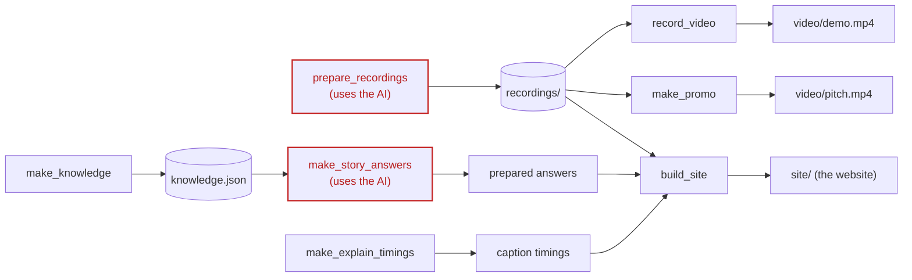

# Making things locally: the scripts

The app itself is `server.py` and the `analyst` package. Everything else it shows (the recorded runs, the
videos, the chat's prepared answers, the website) is made by a script in
[`app/scripts/`](../app/scripts/). This page says what
each one makes, what it needs, and when to run it again.

Run them from the `app` folder. On a Mac or Linux, `./demo.sh` has a short name for each. On Windows, use the
long form:

```bash
./demo.sh site                                  # Mac or Linux
.venv\Scripts\python -m scripts.build_site      # Windows
```

## How they fit together

Most scripts feed the website. Only the two in red call the AI, so they're the ones that cost tokens.
(`record_video --mode live` would too, but the normal videos replay the recordings instead.)



## At a glance

| Script | `./demo.sh` | Makes | Uses the AI? |
|---|---|---|---|
| [`check_key`](../app/scripts/check_key.py) | (run by the double-click setup and start files) | A plain message: is the AI key in `.env` working? | Checks the key only |
| [`prepare_recordings`](../app/scripts/prepare_recordings.py) | `prepare` | One live run of every demo case, saved for Replay | Yes, about 120,000 to 160,000 tokens |
| [`record_video`](../app/scripts/record_video.py) | `video`, `video-dry` | The narrated walkthrough video, `video/demo.mp4` | No (replays the recordings) |
| [`make_promo`](../app/scripts/make_promo.py) | `pitch` | The 60-second pitch video, `video/pitch.mp4` | No |
| [`make_explain_timings`](../app/scripts/make_explain_timings.py) | `timings` | Word timings for the Explain captions | No |
| [`make_knowledge`](../app/scripts/make_knowledge.py) | `knowledge` | The Ask chat's knowledge base | No |
| [`make_story_answers`](../app/scripts/make_story_answers.py) | `story` | Prepared answers for the chat's suggested questions | Yes |
| [`build_site`](../app/scripts/build_site.py) | `site` | The website, in `../site` | No |

The checks (`./demo.sh test`) stay in `app/test_demo.py`: they test the app rather than make anything.

## check_key

*Source: [app/scripts/check_key.py](../app/scripts/check_key.py)*

Reads `app/.env` and asks each AI service whether its key works. It says plainly if a key is missing or was
rejected, and what to do next, or that it couldn't reach the service (offline). It never stops anything,
because Replay mode works without a key. The double-click Setup and Start files run it for you.

```bash
.venv/bin/python -m scripts.check_key
```

## prepare_recordings

*Source: [app/scripts/prepare_recordings.py](../app/scripts/prepare_recordings.py)*

Runs every demo case live, once, and saves each run to `recordings/`. It also records the scorecard's extra
questions and the weekly briefing. Replay mode, both videos and the website all play these recordings back,
so this is the one run that has to happen with a working AI.

It uses about 120,000 to 160,000 tokens, most of a day's free Groq allowance. To re-record only some cases,
name them:

```bash
./demo.sh prepare
./demo.sh prepare northwest_margin guard_forecast
```

**Run it again** after changing the rulebook, a tool, or a demo case. A live run overwrites that case's recording.

## record_video

*Source: [app/scripts/record_video.py](../app/scripts/record_video.py)*

Opens the app in a real browser, plays every scene from the recordings, and saves `video/demo.mp4`. On a Mac it
adds a spoken narration with the built-in `say` voices. It needs `ffmpeg`.

| Command | What it does |
|---|---|
| `./demo.sh video` | Replays your recorded live runs (the one to show people) |
| `./demo.sh video --no-voice` | The same, without narration |
| `./demo.sh video --voice Daniel` | Another macOS voice |
| `./demo.sh video --rehearsal` | Adds the planted-anomaly scene |
| `./demo.sh video-dry` | A test video with no AI at all, labelled DRY RUN. Don't present it as the agent. |

## make_promo

*Source: [app/scripts/make_promo.py](../app/scripts/make_promo.py)*

Renders the 60-second pitch video, `video/pitch.mp4`. It plays scenes from the app in a browser, cuts them to
the music, and lays the voiceover lines on top. Before rendering, it checks that each recording it shows
still says what the voiceover claims. A new live run can change an answer, and it stops if one no longer
matches (add `--force` to render anyway). It needs `ffmpeg`, the music and voice files in `promo/audio/` ([Audio sources](audio-sources.md)),
and the recordings.

```bash
./demo.sh pitch
```

## make_explain_timings

*Source: [app/scripts/make_explain_timings.py](../app/scripts/make_explain_timings.py)*

The "Explain this page" button plays a voice clip and highlights each word as it's spoken. This script measures
the pauses in each clip with `ffmpeg` and works out when each word starts. It writes
`web/explain/timings.json`.

**Run it again** after changing an Explain line or replacing its mp3.

```bash
./demo.sh timings
```

## make_knowledge

*Source: [app/scripts/make_knowledge.py](../app/scripts/make_knowledge.py)*

Builds the Ask chat's knowledge base: the course's training guide and starting notebook, our finished
notebook, and every page of this blog, cut into passages the chat can search. It writes `data/knowledge.json`
for the local app and `../worker/knowledge.json` for the online chat.

The course files aren't in this repo, so you point it at your own copy of the course repo. Both outputs are
git-ignored, because they hold course material. Without `--course`, it uses only our notebook and docs.

```bash
./demo.sh knowledge --course /path/to/capstone-project-2-business_analyst_agent
```

## make_story_answers

*Source: [app/scripts/make_story_answers.py](../app/scripts/make_story_answers.py)*

Asks the AI each suggested question in the chat, with the same notes and rules as the live chat, and saves the
answers to `web/story/answers.json`. Those answers appear instantly and cost nothing, online and locally.

```bash
./demo.sh story              # every question
./demo.sh story --missing    # only questions without an answer yet
```

**Run it again** after editing the history, the requirements or the build guide, then rebuild the site.

## build_site

*Source: [app/scripts/build_site.py](../app/scripts/build_site.py)*

Builds the public website into `../site`, which GitHub publishes as Pages:

- **The front page:** the pitch video and links.
- **The demo:** the same screens as the local app. The website has no server, so every answer is saved as
  a file, made by the same code the local app uses in Replay mode.
- **This blog:** every page in `docs/`.
- **The API reference.**
- **The deck and the pitch page.**

It also writes the team names into the readme.

```bash
./demo.sh site
```

**Run it again** after any change to `docs/`, the screens, or the recordings, then commit and push `site/`.
