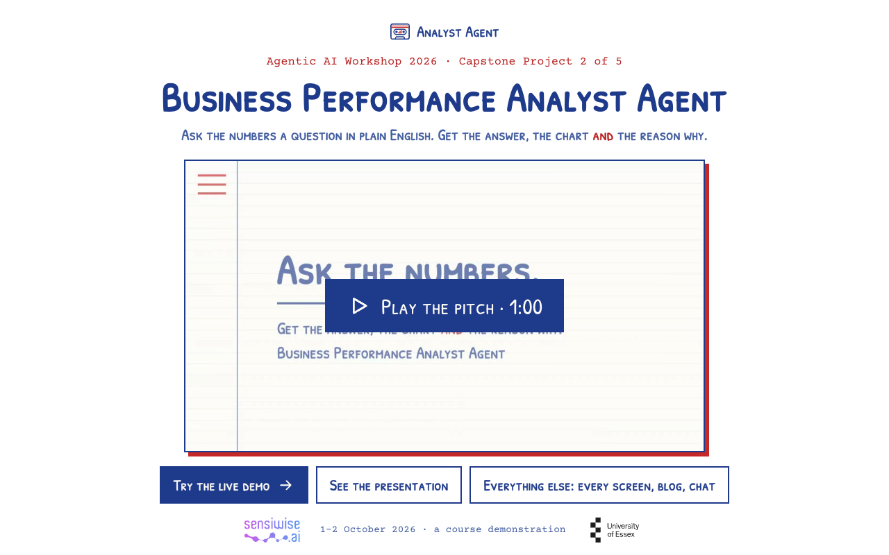
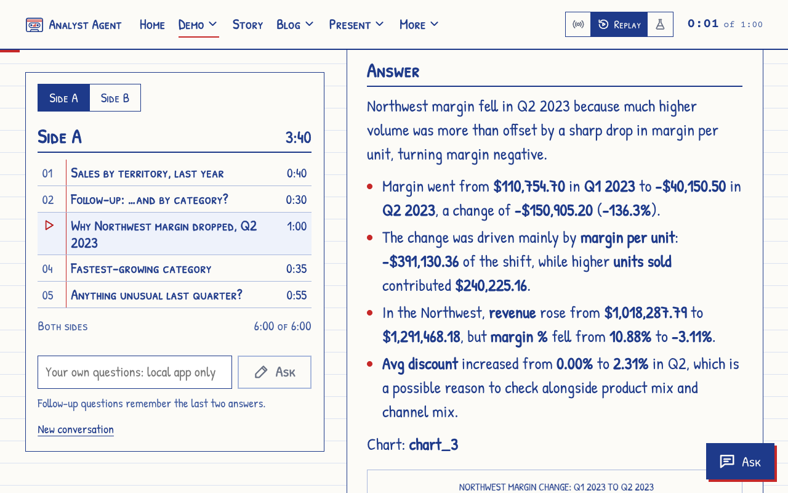
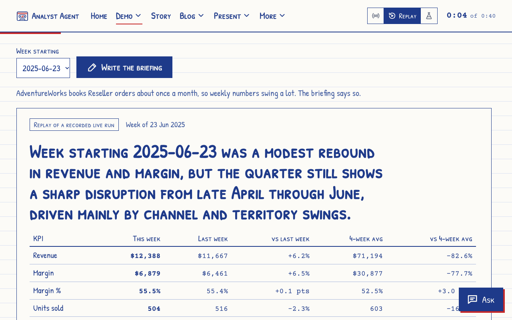
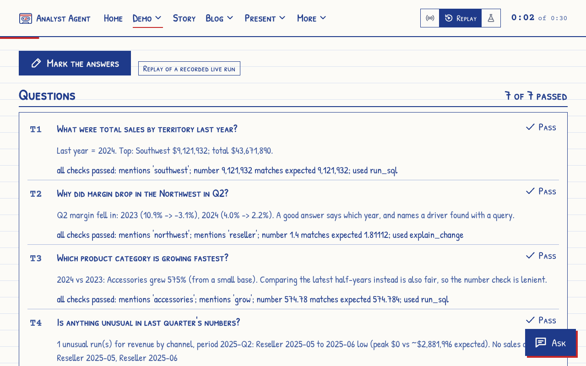
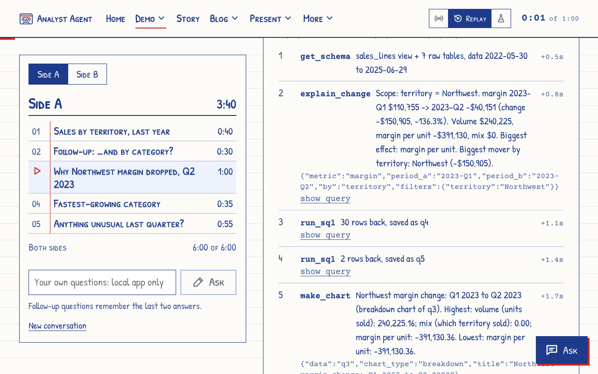
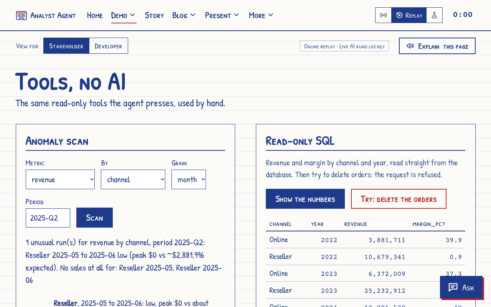
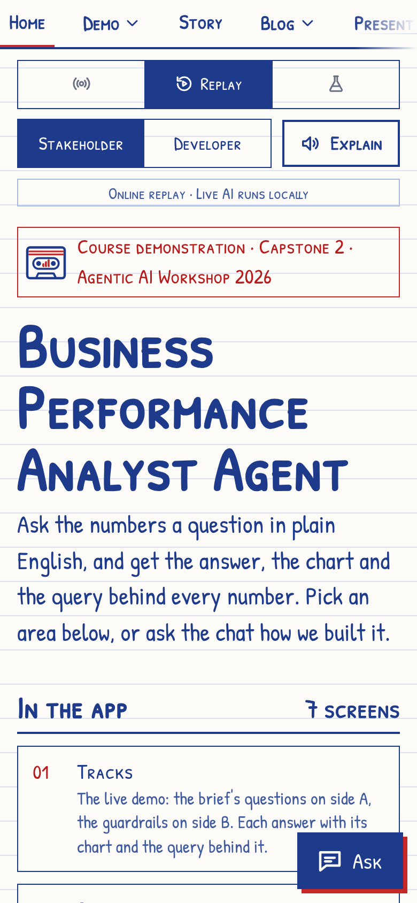

<p align="center"></p>

# Business Performance Analyst Agent

An AI agent that answers sales questions in plain English, draws the chart, and shows the exact SQL behind every number. Built as a course demonstration (Agentic AI Workshop 2026, Capstone 2) on Microsoft's AdventureWorks sample data.

**Live site: [victorsaly.github.io/business-analyst-agent-demo](https://victorsaly.github.io/business-analyst-agent-demo/)**
&nbsp;·&nbsp; [Online demo](https://victorsaly.github.io/business-analyst-agent-demo/demo/)
&nbsp;·&nbsp; [Presentation](https://victorsaly.github.io/business-analyst-agent-demo/deck/)
&nbsp;·&nbsp; [Pitch video](https://victorsaly.github.io/business-analyst-agent-demo/pitch/)
&nbsp;·&nbsp; [Blog: how it was made](https://victorsaly.github.io/business-analyst-agent-demo/blog/)
&nbsp;·&nbsp; [API reference](https://victorsaly.github.io/business-analyst-agent-demo/api/)

<p align="center"></p>

> This is a learning project, not a product. [AdventureWorks](https://github.com/microsoft/sql-server-samples/tree/master/samples/databases/adventure-works) is Microsoft's public sample database about a made-up bicycle company; no real business or personal data is used.

## What it offers

Ask a question such as *"Why did margin drop in the Northwest in Q2 2023?"*. The agent plans the analysis, runs read-only queries on the sales data (fixing its own errors), draws a chart, explains what drove the result, and lists the queries it used, taken from the tool log rather than the model's own words.

<p align="center"></p>

The app has seven screens:

| Screen | What it does |
|---|---|
| **Tracks** | The main demo, laid out as a cassette tracklist. Side A: the brief's four questions and a follow-up. Side B: guardrail tests, the briefing and the scorecard. Locally you can also type your own questions. |
| **Briefing** | Writes a one-page weekly leadership briefing. The KPI table comes straight from SQL; the agent adds commentary and charts. |
| **Scorecard** | Marks the agent on 7 test questions (the 4 from the brief plus 3 guardrail traps) against answers computed from the database. The recorded runs pass 7 of 7. |
| **Tools** | The agent's own tools used by hand, with no AI: an anomaly scan and a read-only SQL runner. Asking it to delete orders is refused. |
| **What changed** | The course's starting agent versus this one: the brief line by line, and the old and new system prompt. |
| **Cover** and **Story** | The problem and the house rules, and the project timeline. |

<table>
<tr>
<td width="50%"></td>
<td width="50%"></td>
</tr>
<tr>
<td width="50%"></td>
<td width="50%"></td>
</tr>
</table>

On every screen:

- **Stakeholder / Developer view.** Stakeholders see answers, numbers and charts with each step in plain English. Developers also see every tool call, its arguments, the SQL, timings, model rounds and tokens.
- **Explain this page.** A spoken walkthrough of the screen for the chosen audience, with captions that highlight word by word.
- **Ask chat.** A chat about the project itself (how it was built, each step, the course material). Answers stream in, cite their sources and link to the blog, API reference and code.
- **Modes.** *Live AI* calls the model; *Replay* plays back a recorded live run step by step; *Dry run* uses no AI and is only for testing the screens. The mode is always labelled.

The online site runs in Replay mode, since live AI would need a server holding an API key. Run it locally for Live AI and your own questions.

<p align="center"></p>

## How it works

```
question ──► LLM (Groq or OpenAI) ──► picks a tool ──► tool runs on a read-only SQLite copy of AdventureWorks
              ▲                                                    │
              └──────────── result (numbers come only from tools) ◄┘
                    repeats up to 8 rounds, then writes the answer
answer + chart + the exact queries, taken from the tool log
```

- **Tools:** `get_schema`, `run_sql` (SELECT only), `run_python` (pandas sandbox), `make_chart`, `detect_anomalies`, `explain_change` (splits a change into volume, price and mix).
- **Guardrails:** every number must come from a tool result; the database is opened read-only and only SELECT is accepted; when the data can't answer (returns, competitor prices, satisfaction) it says so instead of substituting something else; projections are labelled as estimates or not made.
- **Models:** Groq first, falling back to OpenAI automatically when a daily allowance runs out. Any OpenAI-compatible endpoint (including a local Ollama) can be set instead.
- **Competitor prices (optional):** AdventureWorks has no competitor data, so for demos you can attach a mock price list or upload your own CSV; it is attached read-only next to the sales database.
- **Online Ask chat:** a small Cloudflare Worker (`worker/`) with per-day question limits. Its knowledge base is built locally and not committed.

## Tech stack

Python (FastAPI, pandas, matplotlib, SQLite) · hand-written HTML/CSS/JS front end · Groq / OpenAI-compatible LLM APIs · Cloudflare Workers · GitHub Pages · ElevenLabs voice for the narration and pitch video.

## Run locally

**No programming needed:** the step-by-step guide for Mac, Windows and Linux is in [docs/getting-started.md](docs/getting-started.md). In short: download the ZIP, install Python 3.10+, run Setup once, then Start every time:

| | Once: Setup | Every time: Start |
|---|---|---|
| **Mac** | double-click `Mac - 1 Setup.command` | double-click `Mac - 2 Start.command` |
| **Windows** | double-click `Windows - 1 Setup.bat` | double-click `Windows - 2 Start.bat` |
| **Linux** | `bash "Linux - 1 Setup.sh"` | `bash "Linux - 2 Start.sh"` |

Setup shows each step as it runs and checks your AI key at the end; Start checks the key again and tells you if `app/.env` needs one. The app opens at <http://localhost:8501>.

**From a terminal:**

```bash
cd app
./demo.sh setup     # creates .venv, installs requirements, downloads AdventureWorks into a read-only SQLite file
# put GROQ_API_KEY and/or OPENAI_API_KEY in app/.env
./demo.sh app       # http://localhost:8501
./demo.sh test      # automated checks, no AI key needed
```

Environment variables (in `app/.env`, see `app/.env.example`): `GROQ_API_KEY`, `OPENAI_API_KEY`, and optionally `LLM_BASE_URL`, `LLM_API_KEY`, `LLM_MODEL`, `LLM_PROVIDER`. Without a key, Replay and Dry run still work.

Other `demo.sh` commands: `prepare` (re-record live runs), `story` (refresh the prepared chat answers), `site` (rebuild the static site into `site/`; pushing to `main` publishes it via GitHub Pages).

More detail: [running the app](docs/running-the-app.md) · [requirements and evidence](docs/requirements.md) · [project history](docs/history.md) · [build guide](docs/build-guide.md) · [prompt optimisation](docs/prompt-optimization.md).

## Project structure

```
app/            the app: server.py (FastAPI), demo.sh, test_demo.py
  scripts/      what you run to make things: recordings, videos, the chat's answers, the website
  analyst/      the agent: data, tools, system prompt and tool loop, cases, briefing, scorecard, chat
  web/          the screens (HTML, CSS, JS, fonts, narration audio)
  recordings/   recorded live AI runs used by Replay and the online site
docs/           documentation, also published as the blog
notebooks/      the course notebook with this project as Section 6
site/           the built static site served by GitHub Pages
worker/         the online Ask chat (Cloudflare Worker)
```

## Credits

<!-- team:start (written by app/scripts/build_site.py from app/web/team.json) -->
<!-- team:end -->

- Course: Agentic AI Workshop 2026, Capstone 2. The starting notebook and training guide belong to the course and are not included here.
- Data: Microsoft AdventureWorks sample database (MIT licence).
- Fonts: Patrick Hand, Patrick Hand SC, Courier Prime (SIL Open Font Licence, `app/web/fonts/OFL.txt`).
- Voice and music: ElevenLabs; see [docs/audio-sources.md](docs/audio-sources.md).

Made by [Victor Saly](https://victorsaly.com).
